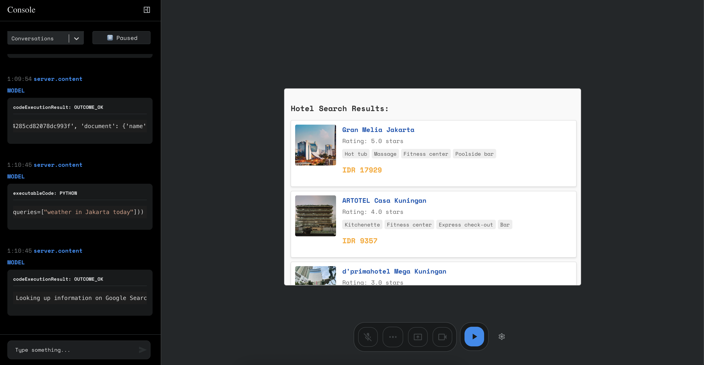

# Live API - Web Console: Conversational Hotel Search Assistant

[](https://www.youtube.com/watch?v=J_q7JY1XxFE)

Watch the general demo of the Live API [here](https://www.youtube.com/watch?v=J_q7JY1XxFE).

## Overview

This repository contains a React-based starter application demonstrating how to build a **conversational travel assistant** focused specifically on **hotel search**, powered by the Google Gemini Live API and Google Cloud Vertex AI Search. This can be extended to any commerce industry(retail, telco, travel, etc.) that are catalog based.

The application showcases how to leverage:

*   **Gemini Live API:** For real-time, low-latency, multimodal user interactions (text, audio). Users can converse naturally with the assistant.
*   **Vertex AI Search:** Connected via Function Calling (`search_discovery_engine` tool), this provides Google-quality semantic search over a private enterprise hotel database. It retrieves specific details like availability, pricing, and amenities based on the user's conversational query.
*   **Function Calling:** Enables the Gemini model to intelligently invoke the `search_discovery_engine` tool when users ask specific hotel-related questions, ensuring responses are grounded in accurate, up-to-date hotel data.
*   **Streaming Responses:** Delivers responses incrementally for a fluid user experience.
*   **Audio Playback:** Streams audio responses directly from the model.
*   **Development Log View:** A unified log interface to monitor API interactions, including function calls to Vertex AI Search, aiding in development and debugging.

This project serves as a foundation for building sophisticated conversational commerce applications where users can interact naturally to find and potentially book services based on real-time, accurate data.

## Core Technologies for Conversational Commerce

This application highlights the powerful synergy between the Gemini Live API and Vertex AI Search for building next-generation conversational experiences:

*   **Gemini Live API:** Provides the conversational frontend. Its real-time, streaming, and multimodal capabilities (supporting text and audio input/output in this implementation) allow for natural, low-latency interactions that mimic human conversation. This makes the user experience intuitive and engaging.

*   **Vertex AI Search:** Acts as the powerful, intelligent backend for data retrieval.
    *   **Grounded Responses:** Functions as an out-of-the-box Retrieval-Augmented Generation (RAG) system. By retrieving information directly from your configured hotel database *before* generating a response, it ensures the assistant's answers about hotel details (pricing, availability, amenities) are accurate and based on your specific enterprise data, minimizing hallucinations.
    *   **Google-Quality Search:** Delivers powerful semantic search capabilities over your private data, understanding the *intent* behind user queries, not just keywords.
    *   **Enterprise Ready:** Offers scalability, security, and features tailored for enterprise use cases, including specific optimizations for industries like retail and commerce.
    *   **Function Calling Integration:** Seamlessly integrates with the Gemini model via the `search_discovery_engine` tool, allowing the AI to access the search capabilities precisely when needed based on the conversation context.

*   **Synergy:** Combining the Live API's fluid conversational interface with Vertex AI Search's grounded, intelligent data retrieval enables sophisticated conversational commerce applications. Users can ask complex questions about hotels in natural language and receive accurate, relevant information in real-time, directly within the chat interface.

## Features

*   **Event-Emitting Websocket Client:** Simplifies communication between the frontend and the Live API websocket.
*   **Audio Input/Output:** Handles microphone input streaming and playback of streamed audio responses.
*   **Vertex AI Search Integration:** Demonstrates function calling to query a Vertex AI Search engine for hotel data.
*   **Environment Configuration:** Easily configure API keys, model names, Vertex AI Search endpoints, and other settings via a `.env` file.
*   **Log Viewer:** Centralized view for inspecting requests, responses, and tool interactions (including Vertex AI Search calls).
*   **React-Based:** Built with Create React App for a familiar development experience.

## Setup

Follow these steps to get the project running locally:

**Prerequisites:**
*   Node.js (LTS version recommended)
*   npm (usually included with Node.js)
*   Access to Google Cloud Platform with Vertex AI Search configured for your hotel data.
*   A Gemini API Key.

**Installation:**
1.  Clone the repository:
    ```bash
    git clone <repository-url> # Replace <repository-url> with the actual URL
    ```
2.  Navigate to the project directory:
    ```bash
    cd live-api-web-console
    ```
3.  Install dependencies:
    ```bash
    npm install
    ```

## Configuration

Project configuration is managed through a `.env` file located in the root directory (`live-api-web-console/.env`). Create this file if it doesn't exist (e.g., by copying `.env.example` if provided).

Add the following environment variables to your `.env` file:

*   **`REACT_APP_GEMINI_API_KEY`**: Your Google Gemini API key. Required for Live API authentication. [Create a free API key here](https://aistudio.google.com/apikey).
    ```
    REACT_APP_GEMINI_API_KEY=YOUR_API_KEY_HERE
    ```

*   **`REACT_APP_DISCOVERY_ENGINE_ACCESS_TOKEN`**: An OAuth 2.0 access token with permissions to query your Vertex AI Search engine. This is required for authenticating requests made by the `search_discovery_engine` tool. You'll typically need a mechanism to generate or refresh this token.
    ```
    REACT_APP_DISCOVERY_ENGINE_ACCESS_TOKEN=YOUR_VERTEX_AI_SEARCH_ACCESS_TOKEN
    ```

*   **`REACT_APP_SEARCH_HOTEL_TOOL_URL`**: The API endpoint URL for your configured Vertex AI Search engine. The `search_discovery_engine` function will call this URL. Replace placeholders with your project number and engine ID.
    ```
    REACT_APP_SEARCH_HOTEL_TOOL_URL='https://discoveryengine.googleapis.com/v1alpha/projects/<PROJECT_NUMBER>/locations/global/collections/default_collection/engines/<APP_ENGINE_ID>/servingConfigs/default_search:search'
    ```

*   **`REACT_APP_SEARCH_HOTEL_TOOL_DEFINITION`**: A JSON string defining the schema for the `search_discovery_engine` tool. This tells the Gemini model how and when to use Vertex AI Search.
    ```
    REACT_APP_SEARCH_HOTEL_TOOL_DEFINITION='{"name": "search_discovery_engine", "description": "Searches the enterprise hotel database using Vertex AI Search for specific details like location, availability, pricing, and amenities based on the user query.", "parameters": {"type": "OBJECT", "properties": {"query": {"type": "STRING", "description": "The user\'s natural language query for hotel information (e.g., \'hotels in paris near the eiffel tower with a pool\', \'check availability at Grand Hyatt for next tuesday\')."}}, "required": ["query"]}}'
    ```
    *(Note: Ensure the JSON string is properly escaped within the `.env` file).*

*   **`REACT_APP_MODEL_NAME`**: Specifies the Gemini model to use for interactions via the Live API.
    ```
    REACT_APP_MODEL_NAME=models/gemini-2.0-flash-exp
    ```
    *(Example: `models/gemini-1.5-flash-latest`, `models/gemini-2.0-flash-exp`)*

*   **`REACT_APP_GENERATION_CONFIG`**: A JSON string defining parameters that control the model's generation process, including response modality (e.g., audio) and speech configuration.
    ```
    REACT_APP_GENERATION_CONFIG='{"responseModalities":"audio","speechConfig":{"voiceConfig":{"prebuiltVoiceConfig":{"voiceName":"Aoede"}}}}'
    ```
    *(Example structure: `{"temperature": 0.7, "topP": 0.9, "responseModalities": "audio", "speechConfig":{...}}`)*

*   **`REACT_APP_SYSTEM_INSTRUCTIONS`**: Text providing base instructions to the Gemini model, guiding its behavior, persona, and specifically how it should use the `search_discovery_engine` tool versus general web search.
    ```
    REACT_APP_SYSTEM_INSTRUCTIONS='You are a helpful travel assistant. When asked specifically to search for hotels (e.g., finding hotels in a location, checking availability, getting prices, amenities), use *only* the \'search_discovery_engine\' function. For other general web searches (e.g., news, facts, topics not related to specific hotel bookings), use the Google Search tool.'
    ```

## Running the Project

Once configured, start the development server:

```bash
npm start
```

This command runs the app in development mode. Open [http://localhost:3000](http://localhost:3000) in your browser to view the application. The page will automatically reload when you make code changes, and lint errors will appear in the console.

## Development Notes

This project was bootstrapped with [Create React App](https://github.com/facebook/create-react-app). It consists of several core components:

*   An event-emitting websocket client (`multimodal-live-client.ts`) to manage communication with the Live API.
*   A communication layer for processing audio input (`audio-recorder.ts`, `audio-streamer.ts`) and output.
*   Integration logic for handling the `search_discovery_engine` function call to Vertex AI Search.
*   Boilerplate views and components (`App.tsx`, `ControlTray.tsx`, `Logger.tsx`, etc.) for building your application interface and viewing logs.

## Available Scripts

In the project directory, you can run:

### `npm start`

Runs the app in development mode. Open [http://localhost:3000](http://localhost:3000) to view it. The page reloads on edits, and lint errors are shown in the console.

### `npm run build`

Builds the app for production into the `build` folder. It bundles React in production mode and optimizes the build for performance. The build is minified, includes hashes in filenames, and is ready for deployment. See the Create React App [deployment documentation](https://facebook.github.io/create-react-app/docs/deployment) for more details.

## Disclaimer

_This is an experiment showcasing the Live API and Vertex AI Search integration, not an official Google product. We’ll do our best to support and maintain this experiment but your mileage may vary. We encourage open sourcing projects as a way of learning from each other. Please respect our and other creators' rights, including copyright and trademark rights when present, when sharing these works and creating derivative work. If you want more info on Google's policy, you can find that [here](https://developers.google.com/terms/site-policies)._
